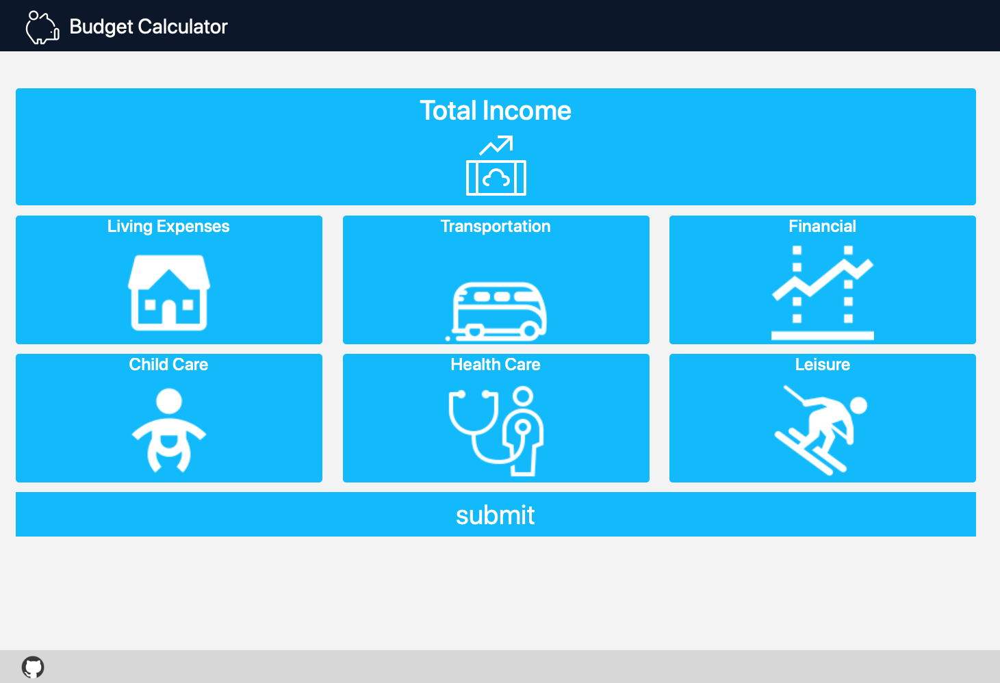

# BudgetCalculator

BudgetCalculator is a a web page developed using JavaScript that accepts user input for his/her income and expenses, and outputs a summary page of his/her monthly spending.


## Web Page

 [Website](https://ahmedwab.github.io/budgetcalculator/) https://ahmedwab.github.io/budgetcalculator/





## Contributing
Pull requests are welcome.For any structural or scripting changes, please open request to do so.

Please make sure to test website before making any changes.
## Support 

```
Shoot me a private message on my page.
```
## Project Status 

```
A few minor changes could be done for the summary page. 

The charts need to be displayed in divs of their own where they are displayed side by side.
```


## License
[MIT](/LICENSE)
